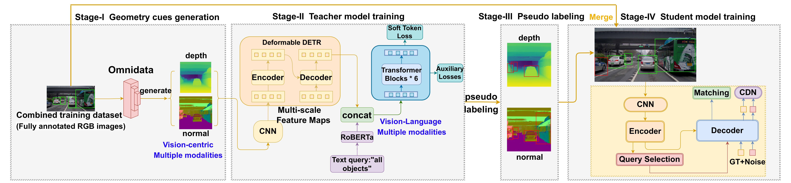
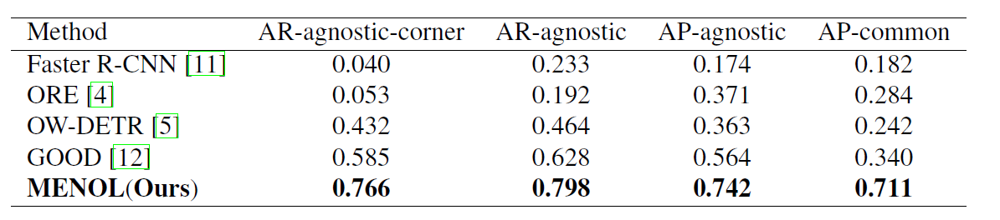

# Official implementation of "MENOL:Multimodal-Enhanced Objectness Learner for Corner Case Detection in Autonomous Driving"


### [Arxiv](https://arxiv.org/abs/2402.02026) | [IEEE Xplore](https://ieeexplore.ieee.org/document/10647363)

🎉🎉🎉 Our work is accepted to 2024 IEEE International Conference on Image Processing (ICIP) as oral presentation

💡💡💡 Demo code and pretrained weights are released




## Abstract
#### Previous works on object detection have achieved high accuracy in closed-set scenarios, but their performance in open-world scenarios is not satisfactory. One of the challenging open-world problems is corner case detection in autonomous driving. Existing detectors struggle with these cases, relying heavily on visual appearance and exhibiting poor generalization ability. In this paper, we propose a solution by reducing the discrepancy between known and unknown classes and introduce a multimodal-enhanced objectness notion learner. Leveraging both vision-centric and image-text modalities, our semi-supervised learning framework imparts objectness knowledge to the student model, enabling class-aware detection. Our approach, Multimodal-Enhanced Objectness Learner (MENOL) for Corner Case Detection, significantly improves recall for novel classes with lower training costs. By achieving a 76.6% mAR-corner and 79.8% mAR-agnostic on the CODA-val dataset with just 5100 labeled training images, MENOL outperforms the baseline ORE by 71.3% and 60.6%, respectively.

# 🛠️ Installation

Our implementation is based on [mmdetection](https://github.com/open-mmlab/mmdetection).

Please use the following commands to create conda env with related dependencies.

```setup
conda create -n menol python=3.8 -y
conda activate menol
conda install pytorch=1.7.0 torchvision -c pytorch
conda install cuda -c nvidia
pip install mmdet
pip install mmcv==2.0.0
git clone https://github.com/open-mmlab/mmdetection.git
cd mmdetection
pip install -v -e . 
```

## Dataset Preparation

Please download the CODA dataset from https://coda-dataset.github.io/download.html (download the CODA2022 val set).
Then download the SODA10M dataset from https://soda-2d.github.io/download.html
(download the SODA10M Trainval set). Take the first 12069 images from the SODA10M dataset as the train dataset and rename them as 3908.jpg, 3909.jpg, ..., 15976.jpg, the rest as the val dataset.
Place them in the `dataset` directory.
We also provide the processed depth and normal images of the SODA10M dataset. Please download the directory `img` from [Google Drive](https://drive.google.com/drive/folders/1A2zmJ0nZWz0TIwlFGSXj3iAmM_Htb9LA?usp=drive_link) and place it in the root directory.
The dataset should be organized as follows:
```
dataset
  ├── CODA
    ├── images
        ├── 0001.jpg
        ...
    ├── annotations.json

  ├── SODA10M
    ├── images
        ├── train
          ├── 3908.jpg
          ...
          ├── 15976.jpg
        ├── val
    ├── annotations_train.json
    ├── annotations_val.json

  ├── soda_depth_only
    ├── 3908.jpg
      ...
    ├── 15976.jpg

  ├── soda_normal_only
    ├── 3908.jpg
      ...
    ├── 15976.jpg
```

# 🚀 Training

We provide the generated pseudo labels of the SODA10M dataset (Pseudo labeled by our proposed Objectness learner, which act as the teacher model). Please download the directory `Final_test` from [Google Drive](https://drive.google.com/drive/folders/1A2zmJ0nZWz0TIwlFGSXj3iAmM_Htb9LA?usp=drive_link).
Then you can get the 'pseudo_depth.json' and 'pseudo_normal.json' files.
These files are used as additional training data to train the student model.

To train the student model, please run the following command:
For a single GPU:
```bash
cd ./mmdetection
python tools/train.py configs/dino/dino-5scale_swin-l_8xb2-36e_coco.py --work-dir ./work_dir
```
For multiple GPUs (e.g. 2 GPUs):
```bash
cd ./mmdetection
./tools/dist_train.sh configs/dino/dino-5scale_swin-l_8xb2-36e_coco.py 2 --work-dir ./work_dir
```

# 🏃🏼 Inference

We provide the final checkpoint of our student model, which is the final open-world object detector. Please download the directory 'checkpoints' from [Google Drive](https://drive.google.com/drive/folders/1A2zmJ0nZWz0TIwlFGSXj3iAmM_Htb9LA?usp=drive_link) and place it in the root directory.
To use the trained model to detect objects in images, please run the following command:
```bash
python inference.py
```
Then you can get the detection results, which are stored in the file './Final_test/my_results.json'.

# 💖 Evaluation

Please download the directory `Final_test` from [Google Drive](https://drive.google.com/drive/folders/1A2zmJ0nZWz0TIwlFGSXj3iAmM_Htb9LA?usp=drive_link) and place it in the root directory.
To evaluate the performance of our model, we provide ground truth annotations of the CODA dataset and the results of our model. The code to get the evaluation metrics is also provided.
'my_results.json' contains the detection results of our model on CODA dataset, 'gt.json' contains the ground truth annotations,
'gt_agnostic.json' contains the ground truth annotations in agnostic format,
'gt_agnostic_corner.json' contains the ground truth annotations in agnostic format for corner cases.
Here is the command to run the evaluation code:
1. Run the following command to get the 'my_results_agnostic.json' file:
```bash
python convert_to_agnostic.py 
```
2. Run the following command to get the final evaluation metrics:
```bash
python test.py  
```
Here are the evaluation results compared with the baseline model on CODA dataset:


# 🌹 Acknowledgement

We appreciate helps from :
* public code: [MMDetection](https://github.com/open-mmlab/mmdetection), [Omnidata](https://github.com/EPFL-VILAB/omnidata)
* model architecture: [DINO](https://github.com/IDEA-Research/DINO)

# 🤝🏼 Citation

If our project is helpful for your research, please give me a star and consider citing :
``` 
@INPROCEEDINGS{10647363,
  author={Xiao, Lixing and Shi, Ruixiao and Tang, Xiaoyang and Zhou, Yi},
  booktitle={2024 IEEE International Conference on Image Processing (ICIP)}, 
  title={Multimodal-Enhanced Objectness Learner For Corner Case Detection In Autonomous Driving}, 
  year={2024},
  volume={},
  number={},
  pages={715-721},
  keywords={Training;Geometry;Visualization;Costs;Roads;Image processing;Object detection;Corner Case Detection;Autonomous Driving;Objectness Notion;Multiple Modalities;Semisupervised Learning},
  doi={10.1109/ICIP51287.2024.10647363}
  }

```
